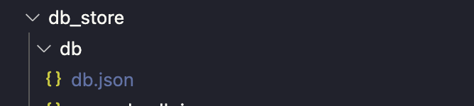

## Development
- Before to do something: please understand [how it work](./how_it_work.md)

## 1. Setup
- Init database: 
    - Manually:
        - Create `swgit.json` file into `swgit_store/db` folder.
        - Copy code line below and paste to `swgit.json` file.
            ``` json
            {
                "users": [],
                "repos": [],
                "default": {}
            }
            ```
    - Command line:
        ```
        mkdir -p swgit_store/db && cp -i db_store/db/example_db.json swgit_store/db/swgit.json 
        ```
    - Resualt: 
    
- Init test:
    - Manually:
        - Create folder with name `data` in `test` folder
    - Command line:
        ```
        mkdir test/data
        ```
- Init ssh
    >If you dont have ssh key before
    - Run command line on mac or linux:
        ```
        mkdir ~/.ssh
        ```
    - Window:
## 2. Install 
```
    make install
    # or
    npm install -g .
```
Now you can run `swgit --help` on your terminal.

Check this [doc](./commands.md)

## 3. Uninstall 
```
    make uninstall
    # or
    npm uninstall -g .
```

## 3. Release new tag
> Ref: follow up this [link](https://www.atlassian.com/git/tutorials/inspecting-a-repository/git-tag)
- Create a tag: 
```
git tag -a <tag_name> -m <tag_name>
```
- Push your tag: 
```
git push origin <tag_name>
```