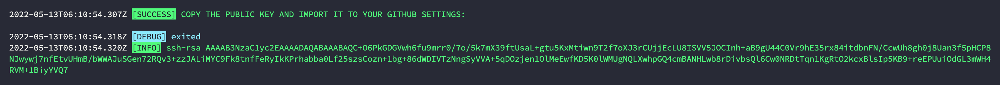

## Swgit
[](https://semver.org)
## Getstarted
## Install 
> We don't have officially version right now, please use it with development mode.
1. MAC OS
```
brew tap 9bany/swgit
brew install swgit
```
1. Ubuntu
1. Window
1. [Development](./development.md)

## Basic example

## Init
> run this command before use anything.
```
swgit init
```
## 1. Create user
- Run command line
    ```
        swgit --add.username=example_user --add.email=example_user@email.com
    ```
- Your console
    
## 2. Add ssh key
- Copy ssh key from the console.
    ```
    ssh-rsa AAAAB3...
    ```
- Add ssh key to [github account settings](https://github.com/settings/keys)
## Create another user
> Please follow step 1 and 2 above

## 3. Clone your repo
- Switch the user who can access, commit, push, pull... your repository 
```
swgit -s=<username>
```
- Clone repo
> Required: your url repo is an ssh url. example: **git@github.com:9bany/git-switch.git**

```
swgit -c=<url_repo>
```
- `cd` to your work space

Now, you can use `swgit <push | pull | commit | add | ...>` in this workspace and do not switch user before.

## Swgit config
### Add an user
> If you dont have ssk key paths, please ignore it. Swgit will create new ssh key for you.
- Create new user with username and email
- Example:
    ```
    swgit --add.username=<username> --add.email=<email> --add.privateKeyPath=<privateKeyPath> --add.empublicKeyPathail=<publicKeyPath>
    # or
    swgit -a.username=<username> -a.email=<email> -a.privateKeyPath=<privateKeyPath> -a.publicKeyPath=<publicKeyPath>
    ```
- Description:

|name   |type  | required  | default|
|---|---|---|---|
| username  |string|true   | 
| email | string  | true  |
|  host | string  | optional  | github.com
|  privateKeyPath | string  | optional  | 
|  publicKeyPath | string  | optional  |


### User info
- Return and log user info with username

    ```
    swgit --get=<username>
    # or
    swgit -g=<username>
    ```
- Description:

|name   |type  | required  |
|---|---|---|
| username  |string|true   |

### Update user info
- Example:
```
swgit --update.<name>=<value>
```
- Description:

|name   |type  | required  |
|---|---|---|
| username  |string|true   |
| newUser  |string|optional   |
| privateKeyPath  |string|optional   |
| publicKeyPath  |string|optional   |
| isDefault  |string|optional   |
| email  |string|optional   |

## Switch default user
- Example:
```
swgit --switch=<username>
# or
swgit -s=<username>
```
- Description:

|name   |type  | required  |
|---|---|---|
| username  |string|true   |

## Get user default of the repo
- Example:
```
swgit --ur
# or
swgit --user-repo
```
